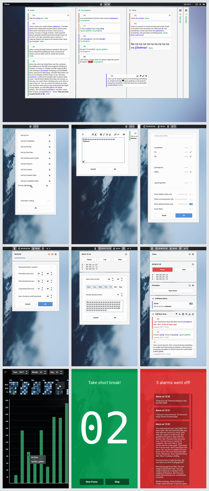

<div align="center">

### Time ++

</img>

**A [todo.txt manager](https://github.com/todotxt/todotxt/),
time tracker, timer, stopwatch, pomodoro, and alarms [gnome-shell extension](https://extensions.gnome.org/about/).**

</div>

---

<details>
    <summary><b>Table of Contents</b></summary>

* [Installation](#installation)
* [Warnings](#warnings)
* [Translations](#translations)
* [Sections](#sections)
* [Fullscreen Interface](#fullscreen-interface)
* [Todo.txt Manager](#todotxt-manager)
* [Todo.txt Syntax](#todotxt-syntax)
* [Todo.txt Extensions](#todotxt-extensions)
* [Time Tracker](#time-tracker)
* [DBus API](#dbus-api)
* [Custom Theme Support](#custom-theme-support)
* [Keyboard Shortcuts](#keyboard-shortcuts)
* [Preview](#preview)

</details>

---

### Installation

1. Download the extension:
   * [The latest version](https://github.com/zagortenay333/timepp__gnome/archive/master.zip) supports `gnome-shell 3.34` (`master-branch`).
   * For older versions go to [releases](../../releases).
2. Extract and rename the downloaded folder to `timepp@zagortenay333` and move it into  
   `/home/YOUR_USER_NAME/.local/share/gnome-shell/extensions/`.
3. Restart your desktop shell by typing <kbd>Alt</kbd>+<kbd>F2</kbd>, then <kbd>r</kbd>, then <kbd>Enter</kbd>.
4. Enable the extension via the `gnome tweak tool` program.

---

### Warnings :bangbang:

1. This extension is in very low-maintenance mode (don't make feature requests).
2. In case of a bug, this extension can freeze your OS, which could require significant effort on your part to solve.
3. All gnome-shell extensions get disabled in the lock screen. Alarms, timers, etc will not work.

---

### Translations

If you want to help out with translations, check out the instructions in the
[po_files](data/po_files) dir.

---

### Sections

This is a modular extension consisting of several sections (timer, stopwatch, alarms..)

Each section can open as a separate menu when it's icon is clicked, or it
can appear together with other sections in one menu.

Individual sections can be disabled if you don't need them.

Right-clicking on the panel icons will open a context section with
some useful links.

---

### Fullscreen Interface

This extension has a fullscreen interface, which can be used to control a
corresponding section as well as replace regular notifications.

The interface has multi-monitor support, and it can be opened _(and brought into
focus)_ via a keyboard shortcut.

---

### Todo.txt Manager

Some of the features of the todo.txt manager are:

* Kanban boards.
* Fuzzy task searching.
* Filtering by context, project, priority, custom fuzzy filters...
* Toggling a filter on/off by clicking on a priority, context, or proj in a task.
* Support for multiple todo files and corresponding done files and csv dirs.
* Compound sorting by priority, due date, completion date, creation date, etc...
* Fuzzy autocompletion for contexts and projects when inline editing a task.
* Autoupdating when the todo.txt file changes.
* Deleting all completed tasks and optionally storing them into a done.txt file.
* Switching between different views via keyboard shortcuts.
* Browse your todo time tracker data in a fullscreen view.

---

### Todo.txt Syntax

* The todo.txt format is specified here: https://github.com/todotxt/todo.txt

* In various places throughout this extension (todo.txt, alarms, timer) there is
support for a simple markup language:

    * Simple text formatting:
        ```
        `     escape other markdown
        ``    monospace and escape other markdown

        *     bold
        **    italic
        ***   bold with a red bg

        __    italic
        ___   underscore

        ~~    strikethrough

        #     xx-large
        ##    x-large
        ###   large

        For example, *bold*, and ##extra large##, and ``monospaced``, and
        ***this __one__ is nested***, etc...
        ```

    * File paths and web links:
        ```
        https://www.google.com
        www.google.com

        /home/user/Documents
        ~/Documents
        ~/Documents/img.png
        ~/Documents/file\ with\ spaces.png
        ```

    * Multiple lines can be used by adding `\n` to represent a newline:
        ```
        (A) A task with\nmultiline\n@support \n +asdf
        ```
---

### Todo.txt Extensions

A todo.txt extension is just a `key:val` string you type into your todo.txt
file.

The following extensions are supported:

<table>
    <tr>
        <td valign="top"><code>kan:kan_string</code></td>
        <td>
            Used to specify kanban boards.<br>
            Multiple kan boards can be specified by writing multiple kan extensions into the todo.txt file<br><br>
            The format of the extension is: <code>kan:[*]name|column1[|column2|...]</code><br><br>
            <ul>
                <li>The optional * indicates whether the kanban board is active.</li>
                <li>Each column is either:<br>
                <ul>
                    <li>a comma separated list of todo.txt priorities, contexts, projects.</li>
                    <li>a string indicating a 'kitchen-sink' column.</li>
                    <li>the char '$' indicating a 'kitchen-sink' column with no title</li>
                </ul></li>
                <li>Tasks are split into columns based on whether or not they have one or more properties specified in a column.</li>
                <li>A 'kitchen-sink' column is one into which any task goes.</li>
                <li>The string '(_)' can be used to refer to completed tasks and tasks with no priorities.</li>
                <li>The order of the columns matters.<br>
                    If a task can go into multiple columns, it will be added to the leftmost one.<br>
                    The position of a 'kitchen-sink' column can affect the sorting a lot.</li>
                <li>Columns that start with '_' (underscore) are collapsed (visually minimized).</li>
            </ul>
            Examples:<br>
            <ul>
                <li><code>kan:*main|(A),(B),(C)|(D),(E),(F)|(G)</code></li>
                <li><code>kan:other_project|_(A)|_(B)|(C)|_(D)|(E)|(F)|(G)</code></li>
                <li><code>kan:stuff|(D),@stuf,+my_project|everything\ else</code></li>
                <li><code>kan:a_and_no_prios|(A)|(_)</code></li>
                <li><code>kan:kitchen_sink_with_title|some_title_maybe_with\ spaces</code></li>
                <li><code>kan:no_title|$</code></li>
                <li><code>kan:column_order_matters|$|(A)</code></li>
            </ul>
        </td>
    </tr>
    <tr>
        <td valign="top"><code>tracker_id:string</code></td>
        <td>
            Used to identify a task when starting/stopping
            the time-tracker via the dbus cli or using pomodoro.<br>
            Multiple tasks can have the same tracker_id.
        </td>
    </tr>
    <tr>
        <td valign="top"><code>pin:1</code></td>
        <td>
            Pins a task. A task that is pinned is always visible no matter what
            filters are on. Also, one can sort pinned tasks (for example, always
            on top.)
        </td>
    </tr>
    <tr>
        <td valign="top"><code>pri:A-Z</code></td>
        <td>
            Used to restore the priority of a completed task when it gets reopend.
        </td>
    </tr>
    <tr>
        <td valign="top"><code>h:1</code></td>
        <td>
            <b>This extension disables all other extensions except the <code>kan</code> extension.</b><br><br>
            Hides a task.<br>
            Among other things, can be used to populate the todo manager<br>
            with context/project keywords for autocompletion.<br>
        </td>
    </tr>
    <tr>
        <td valign="top"><code>t|defer:yyyy-mm-dd</code></td>
        <td>
            Defers opening a task until specified date.<br>
        </td>
    </tr>
    <tr>
        <td valign="top"><code>due|DUE:yyyy-mm-dd</code></td>
        <td>
            Sets a due date on a task.<br>
        </td>
    </tr>
    <tr>
        <td valign="top"><code>rec:recurrence_string</code></td>
        <td>
            <b>This extension is incompatible with the <code>due</code> and <code>defer</code> extensions.</b><br><br>
            Used to automatically reopen a task after a given amount of
time.<br><br>
            <i>Each time a task recurs, it's creation date is updated.<br>
            If a task is already open on the date of the recursion, it's
creation date will be updated anyway.</i><br><br>
            The <i>recurrence_string</i> can be in one of 3 diff forms:<br>
            <i>&nbsp;&nbsp&nbsp;&nbsp;(n=natural number, d=days, w=weeks,
m=months)</i><br><br>
            <ol>
            <li>
            <code>rec:n(d|w)</code><br>
                This means that the task will recur n days/weeks after the
creation date.<br>
                <i>- This rec type requires a creation date.</i><br>
                Examples:<br>
                <ul>
                <li>
                <code>x 2000-01-01 2000-01-01 rec:12d</code> means that the task
will reopen<br>
every 12 days starting from <code>2000-01-01</code>. After 12 days it will
look like<br>
                <code>2000-01-13 rec:12d</code>, and 12 days after that it will
look like<br>
                <code>2000-01-25 rec:12d</code>, and so on...
                </li>
                </ul>
            </li><br>
            <li>
                <code>rec:x-n(d|w)</code><br>
                This means that the task will recur n days/weeks after the
completion date.<br>
                <i>- This rec type requires a completion date if the task is
complete.</i><br>
                Examples:<br>
                <ul>
                <li><code>x 2000-01-01 rec:x-12d</code> recurs 12 days after
<code>2000-01-01</code>.</li>
                <li><code>(A) rec:x-3w</code> recurs 3 weeks after completion
date.</li>
                </ul>
            </li><br>
            <li>
                <code>rec:nd-nm</code><br>
                This means that the task will recur on the n-th day of every
n-th month starting<br>
                from the month of creation.<br>
                <i>- This rec type requires a creation date.</i><br>
                <i>- 'Month of creation' here refers to the month written into
the todo.txt file.<br>
                - If a month doesn't have the particular n-th day, the last day
of
that month will be used instead.</i><br>
                Examples:<br>
                <ul>
                <li><code>(A) 2000-01-01 rec:12d-1m</code> recurs on the 12th
day of each
month.</li>
                <li><code>(A) 2000-01-01 rec:1d-1m</code> recurs on the first
day of each
month.</li>
                <li><code>(A) 2000-01-01 rec:31d-1m</code> recurs on the last
day of each
month.</li>
                <li><code>(A) 2000-01-01 rec:64d-1m</code> also recurs on the
last day of each
month.</li>
                <li><code>(A) 2000-01-01 rec:29d-1m</code> recurs on the 29th
day of each
month, and in<br>
                the case of February, on the 28th if it doesn't have 29
days.</li>
                <li><code>(A) 2000-02-02 rec:12d-2m</code> recurs on the 12th
day every 2 months starting from February.<br>
                If the actual current date is <code>2000-02-08</code>, the task
recurs on <code>2000-02-12</code>.<br>
                If the actual current date is <code>2000-02-16</code>, the task
recurs on <code>2000-04-12</code>.<br>
                <li><code>(A) 2000-01-01 rec:1d-12m</code> recurs on the first
day of every year.</li>
                <li><code>(A) 2000-02-01 rec:29d-24m</code> recurs on the last
day of February every 2 years starting from 2000.</li>
                </ul>
            </li>
            </ol>
        </td>
    </tr>
</table>

---

### Time Tracker

You can start time tracking by pressing the play button on a todo card. When you do that,
the task as well as all projects in that task will be tracked.

Time tracking data is stored in csv files. The directory structure of the tracker and the
csv specification can be found [here](data/tracker_spec.md).

When a task that has been tracked is edited, only the corresponding entry
in the daily csv file will be updated; the yearly csv file will not be changed.

---

### DBus API

There is a pretty comprehensive dbus api. Check out the [dbus dir](dbus) for info on
what you can do.

There are also some example scripts that might come in handy. :smile:

---

### Custom Theme Support

This extension supports custom themes. In order to style it, place a
`timepp.css` file into your theme's root directory _(the dir where the
`gnome-shell.css` file is)_.

You must use the `!important` directive in order to override a property from the
extensions' stylesheet.

---

### Keyboard Shortcuts

<table>
    <th align="left" colspan="2">Any fullscreen view</th>
    <tr>
        <td><kbd>Tab</kbd></td>
        <td>navigate forward</td>
    </tr>
    <tr>
        <td><kbd>Ctrl</kbd> + <kbd>Tab</kbd></td>
        <td>navigate backward</td>
    </tr>
    <tr>
        <td><kbd>Esc</kbd></td>
        <td>close fullscreen</td>
    </tr>
</table>

<table>
    <th align="left" colspan="2">Timer (fullscreen)</th>
    <tr>
        <td><kbd>space</kbd></td>
        <td>stop/start timer</td>
    </tr>
    <tr>
        <td><kbd>r</kbd> or <kbd>Backspace</kbd></td>
        <td>repeat last timer preset</td>
    </tr>
    <tr>
        <td><kbd>1</kbd> ... <kbd>9</kbd> and <kbd>0</kbd></td>
        <td>start timer at the time specified by a num key.<br><i>1=1min,
2=2min, ..., 0=10min</i></td>
    </tr>
</table>

<table>
    <th align="left" colspan="2">Stopwatch (fullscreen)</th>
    <tr>
        <td><kbd>space</kbd></td>
        <td>stop/start timer</td>
    </tr>
    <tr>
        <td><kbd>l</kbd> or <kbd>Enter</kbd></td>
        <td>lap</td>
    </tr>
    <tr>
        <td><kbd>r</kbd> or <kbd>Backspace</kbd></td>
        <td>reset</td>
    </tr>
</table>

<table>
    <th align="left" colspan="2">Pomodoro (fullscreen)</th>
    <tr>
        <td><kbd>space</kbd></td>
        <td>stop/start timer</td>
    </tr>
</table>

<table>
    <th align="left" colspan="2">Stats View</th>
    <tr>
        <td><kbd>f</kbd> or <kbd>/</kbd></td>
        <td>start searching history</td>
    </tr>
</table>

<table>
    <th align="left" colspan="2">Todo Section in popup menu (default view)</th>
    <tr>
        <td><kbd>/</kbd></td>
        <td>start searching tasks</td>
    </tr>
    <tr>
        <td><kbd>f</kbd></td>
        <td>open file switcher</td>
    </tr>
    <tr>
        <td><kbd>i</kbd></td>
        <td>open task editor to add new task</td>
    </tr>
    <tr>
        <td><kbd>k</kbd></td>
        <td>open kanban switcher</td>
    </tr>
        <tr>
        <td><kbd>y</kbd></td>
        <td>open filters editor</td>
    </tr>
    </tr>
        <tr>
        <td><kbd>s</kbd></td>
        <td>open sort editor</td>
    </tr>
</table>

<table>
    <th align="left" colspan="2">When focus is inside a task item in popup menu</th>
    <tr>
        <td><kbd>e</kbd></td>
        <td>start editing task</td>
    </tr>
</table>

<table>
    <th align="left" colspan="2">Task editor</th>
    <tr>
        <td><kbd>ctrl</kbd> + <kbd>h</kbd></td>
        <td>resize editor to the left</td>
    </tr>
    <tr>
        <td><kbd>ctrl</kbd> + <kbd>j</kbd></td>
        <td>resize editor down</td>
    </tr>
    <tr>
        <td><kbd>ctrl</kbd> + <kbd>k</kbd></td>
        <td>resize editor up</td>
    </tr>
    <tr>
        <td><kbd>ctrl</kbd> + <kbd>l</kbd></td>
        <td>resize editor to the right</td>
    </tr>
    <tr>
        <td><kbd>ctrl</kbd> + <kbd>f</kbd></td>
        <td>open file selector</td>
    </tr>
    <tr>
        <td><kbd>ctrl</kbd> + <kbd>enter</kbd></td>
        <td>commit the change</td>
    </tr>
</table>

---

### Preview

<b><sub> [Gnome-Shell theme](https://github.com/zagortenay333/ciliora-tertia-shell), [Wallpaper](https://i.imgur.com/raHVKVk.jpg)</sub></b>


