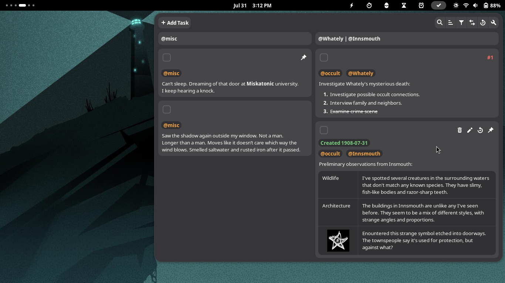

# Cronomix

**All-in-one timer, stopwatch, pomodoro, alarm, todo and time tracker gnome-shell extension**

## Installation

- The latest version supports gnome-shell 46 and 47.
- The latest and older versions of the extension can be installed from
  the [gnome website](https://extensions.gnome.org/extension/6003/cronomix/).
- The latest version can also be installed manually:
    - [Download the extension](https://github.com/zagortenay333/cronomix/tree/master/data/cronomix@zagortenay333.zip).
    - Extract into `~/.local/share/gnome-shell/extensions/`.
    - Restart gnome-shell by logging out/in.
    - Enable the extension via an extensions app.

## Contributing

- Please avoid making feature requests.
- Before reporting a bug, check you have the right gnome-shell version.
- If you want to build the project, read the comment in `scripts/build`.
